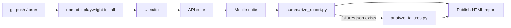

# E2E Playwright Showcase

A single framework covering **UI, API and mobile-web** testing with Playwright/TypeScript,
wired into a Jenkins pipeline, with a Python side-project that uses **LangChain (RAG)** and
the **Jira MCP** protocol to auto-draft defect tickets from failed runs.

Built as a portfolio project - the goal was to keep it small enough to read end-to-end in
ten minutes, not to impress with volume.

## What's tested

| Layer  | Target                                                                 | Why this target |
|--------|-------------------------------------------------------------------------|------------------|
| UI     | [saucedemo.com](https://www.saucedemo.com)                              | Public demo shop, stable, no auth cost, good login/cart/checkout flows |
| API    | [restful-booker](https://restful-booker.herokuapp.com)                  | Well-known public REST practice API (auth, CRUD, partial update) |
| Mobile | Same UI journeys, re-run under Playwright's device emulation (Pixel 7, iPhone 14) | No Appium/real-device farm needed to demonstrate responsive coverage |

## Layout

```
src/
  pages/        Page Object Model (BasePage -> Login/Inventory/Cart/CheckoutPage)
  api/          BookingClient - thin wrapper around the restful-booker endpoints
  fixtures/     Playwright fixtures that hand tests a ready page-object/api client
  utils/        env.ts (config), testData.ts (test data builders)
tests/
  ui/           login + full purchase flow
  api/          booking CRUD
  mobile/       same purchase flow, device-emulated
ci/             Python: run_tests.py (suite runner), summarize_report.py (JSON -> failures.json)
rag-defect-agent/  Python: LangChain RAG + Jira MCP defect-triage agent (see its own README below)
Jenkinsfile     Declarative pipeline gluing the above together
```

## Why Playwright fixtures instead of a classic `beforeEach`

Each spec asks for exactly the page object or API client it needs
(`test('...', async ({ inventoryPage }) => ...`)); fixtures in
[api.fixtures.ts](src/fixtures/api.fixtures.ts) and [ui.fixtures.ts](src/fixtures/ui.fixtures.ts)
handle navigation/login/auth token setup once. Tests stay readable and nobody has to scroll
past setup boilerplate to see what's actually being verified.

## Running locally

```bash
npm install
npx playwright install
cp .env.example .env        # public demo creds already filled in, nothing else required

npm test                    # everything
npm run test:ui             # just the UI suite
npm run test:api            # just the API suite
npm run test:mobile         # just the mobile-emulation suite
npm run report              # open the last HTML report
```

## Playwright tooling used

- **CLI**: `npm run codegen:ui` records a script against SauceDemo to bootstrap new page-object
  locators instead of guessing selectors by hand.
- **MCP**: `npm run mcp:playwright` starts the official [`@playwright/mcp`](https://github.com/microsoft/playwright-mcp)
  server, so an AI coding assistant can drive a real browser (inspect the DOM, click, read
  network calls) while a test is being written, instead of the author flipping between the
  app and the test file.

## CI/CD (Jenkins)

The [Jenkinsfile](Jenkinsfile) targets a Windows Jenkins agent (`bat` steps): install deps,
run the UI/API/mobile suites, always publish the Playwright HTML report, and - only if
`test-results/failures.json` was produced - run the RAG defect-triage agent as a final
stage. A nightly cron trigger complements the normal push-triggered build.

The job itself is provisioned as code - no UI clicking:

```bash
set JENKINS_USER=you
set JENKINS_TOKEN=your-api-token
py ci/create_jenkins_job.py --trigger --suite api
```

[create_jenkins_job.py](ci/create_jenkins_job.py) creates (or updates - it's idempotent) a
parameterized pipeline job via the Jenkins REST API. Build parameters: `SUITE`
(all/ui/api/mobile), `SAUCE_BASE_URL`, `BOOKING_API_BASE_URL`, `RUN_TRIAGE` - so the same
job can run one suite against a different environment without any config change.

A [Dockerfile](Dockerfile) is also included for teams running Linux agents: it packages the
whole framework (browsers + Node + Python) into one image based on the official
`mcr.microsoft.com/playwright` base, so the same suites can run containerized with
`docker run --rm -e CI=true e2e-playwright`.



## RAG defect-triage agent (`rag-defect-agent/`)

Why this exists: when a nightly run fails, someone still has to read the stack trace, decide
if it's a known flaky pattern or a real regression, and open a Jira ticket. This agent
automates the "first draft" of that:

1. `ci/summarize_report.py` turns Playwright's JSON reporter output into a flat
   `test-results/failures.json`.
2. `ingest.py` embeds the team's own notes in `knowledge_base/*.md` (flaky selectors,
   timeouts, environment issues) into a local Chroma vector store - this is retrieval over
   real, small, hand-written notes, not a scrape of the internet.
3. `analyze_failures.py` retrieves the notes most relevant to each failure's error message,
   feeds them plus the error to an LLM via LangChain, and asks for a short root-cause
   hypothesis + next step.
4. `jira_mcp_client.py` files the resulting draft as a Jira issue - first attempting the
   [mcp-atlassian](https://github.com/sooperset/mcp-atlassian) MCP server (`jira_create_issue`
   tool over stdio), falling back to a plain Jira REST call if no MCP server is running.

Every ticket is explicitly labelled `automated-triage` and the description says
"AI-assisted draft - verify before acting" - this is meant to save a human the first-read,
not to replace their judgement.

```bash
cd rag-defect-agent
pip install -r requirements.txt
cp ../.env.example ../.env          # fill in OPENAI_API_KEY + JIRA_* to actually file issues
python analyze_failures.py          # RAG_DRY_RUN=true by default: prints the draft, files nothing
```

## Design notes / trade-offs

- **Mobile = emulation, not Appium.** Real device/native app testing is a different tool
  (Appium) and a different app under test; this repo demonstrates responsive-web coverage,
  not native mobile automation.
- **Public demo targets on purpose.** Anyone cloning this repo can run every suite with zero
  account setup - the framework is the point, not the target app.
- **RAG agent is decoupled from the test run.** It only reads `failures.json`; it can be run,
  skipped, or replaced without touching the Playwright side at all.
- **Secrets never leave `.env`.** `.gitignore` excludes `.env`; Jenkins pulls the same values
  from credential bindings instead.
